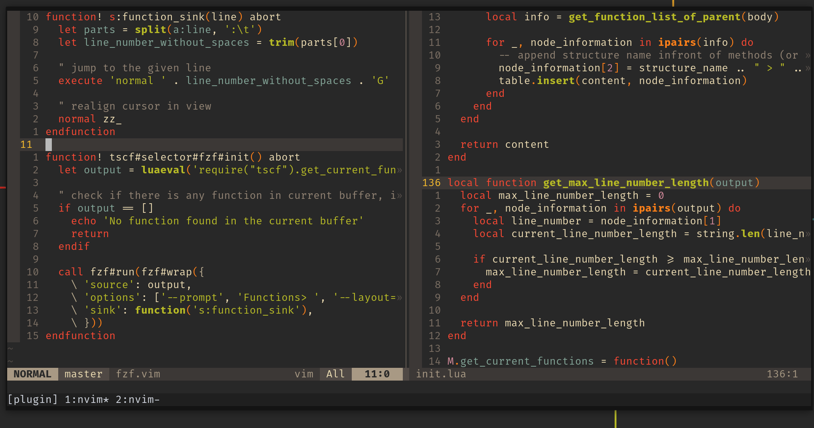

# treesitter-current-functions

treesitter-current-functions (also `tscf`) is a neovim plugin that builds on top of treesitter to

* show all functions or function-like structures in the current buffer
* open a selection tool (`fzf`, `telescope`, etc.)

to quickly jump to the wanted function location


## Example

### fzf and telescope selector in vim, lua, php and js file (older command structure)


### fzf usage (older version)


## Disclaimer

The repo is my first try at a plugin for `vim`/`lua`/`treesitter`.
It can happen that a call will jump to an incorrect location or that it can not find all possible functions,
but as it will only jump, nothing too critical (like deleting text) should be happening even in the worst case.

Not all languages are tested (by far) and not all ways of declaring functions are implemented, but it might still work with not tested languages, if the treesitter structure is similar to others.

Fuzzy finders might break, depending on which ones are used and tested (I will most likely only test one that I am using at the time).

The plugin was tested with neovim version 0.8.3 and up, but can possibly work with earlier versions as well (depends on the given neovim treesitter apis, which are still experimental and change a lot).


## Install & Setup

* Install this repo with your favourite plugin manager
  * `Plug 'eckon/treesitter-current-functions'`
* Install [Treesitter](https://github.com/nvim-treesitter/nvim-treesitter)
* Install one Selection tool
  * [fzf](https://github.com/junegunn/fzf.vim)
  * [telescope](https://github.com/nvim-telescope/telescope.nvim)

An example (via [lazy](https://github.com/folke/lazy.nvim)) could look something like:
```lua
{
  "eckon/treesitter-current-functions",
  dependencies = { "nvim-treesitter/nvim-treesitter", "nvim-telescope/telescope.nvim" },
},
```

Quickly call the plugin, without any mappings:
```vim
:GetCurrentFunctions
```

The plugin does not add any mappings by itself.
As an example following map could be added to your `init.vim`:
```vim
nmap <Leader>cf <CMD>GetCurrentFunctions<CR>
```

## Information

For more information see
* `:help treesitter-current-functions`
* `:help tscf`
* `:help tscf-installation`
* `:help tscf-usage`

Some information about development of the plugin can be found [here](./DEVELOPMENT.md).
